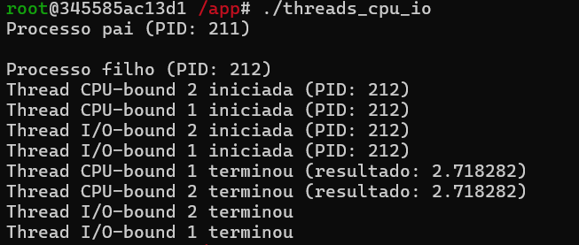

# Relatório da Atividade 4 - Escalonamento de Tarefas

| Disciplina | Docente | Discente | Data |
| :--------: | :-----: | :------: | :--: |
| Sistemas Operacionais | Leonardo A. Minora | João Vitor B. da Silva | 24/05/2025 |

<br>

## Objetivo da Atividade

> O objetivo principal da atividade é aprender e entender como funciona o **escalonamento de tarefas** em um Sistema Operacional utilizando da ferramenta **Docker** construindo uma **imagem Docker** configurada por meio de um arquivo **Dockerfile** com **Linux Fedora** e com **Compilador C** `gcc` para compilação e execução de código-fonte C.

<br>

## Etapa 1 - Inicializando Container e Compilando e Executando Código-Fonte C

### Código-Fonte C Base
```c
#include <stdio.h>
#include <stdlib.h>
#include <unistd.h>
#include <pthread.h>
#include <sys/wait.h>
#include <math.h>

// Thread CPU-bound (cálculos intensivos)
void* cpu_thread(void* arg) {
    printf("Thread CPU-bound %ld iniciada (PID: %d)\n", (long)arg, getpid());

    // Cálculo de π (método de Leibniz)
    double pi = 0;
    int sign = 1;
    for(int i = 0; i < 100000000; i++) {
        pi += sign * (4.0 / (2*i + 1));
        sign *= -1;
    }
    printf("Thread CPU-bound %ld terminou (π aproximado: %f)\n", (long)arg, pi);
    return NULL;
}

// Thread I/O-bound (simula espera)
void* io_thread(void* arg) {
    printf("Thread I/O-bound %ld iniciada (PID: %d)\n", (long)arg, getpid());
    sleep(2);  // Simula operação I/O
    printf("Thread I/O-bound %ld terminou\n", (long)arg);
    return NULL;
}

int main() {
    pid_t pid;
    pthread_t thread_cpu1, thread_cpu2, thread_io1, thread_io2;

    // Cria processo filho
    pid = fork();

    if (pid == 0) { // Processo filho
        printf("\nProcesso filho (PID: %d)\n", getpid());
        
        // Cria threads CPU-bound
        pthread_create(&thread_cpu1, NULL, cpu_thread, (void*)1);
        pthread_create(&thread_cpu2, NULL, cpu_thread, (void*)2);
        
        // Cria threads I/O-bound
        pthread_create(&thread_io1, NULL, io_thread, (void*)1);
        pthread_create(&thread_io2, NULL, io_thread, (void*)2);
        
        // Espera todas as threads terminarem
        pthread_join(thread_cpu1, NULL);
        pthread_join(thread_cpu2, NULL);
        pthread_join(thread_io1, NULL);
        pthread_join(thread_io2, NULL);
        
    } else if (pid > 0) { // Processo pai
        printf("Processo pai (PID: %d)\n", getpid());
        wait(NULL); // Espera filho terminar
    }

    return 0;
}
```

<br>


* Inicializando Container **escalonamento** com a imagem **Docker** criada  a partir de um arquivo **Dockerfile** configurado com **Fedora Linux** e **Compilador C** `gcc`
* No diretório de trabalho `/app` é feito a compilação do código-fonte C usando o comando `gcc threads_cpu_io.c -o threads_cpu_io -lpthread -ln`
* Executando o arquivo .exe do código-fonte C como teste usando `./threads_cpu_io`

<br>

## Etapa 2 - Monitoramento de Recursos

### Comandos Usados para o Monitoramento:
* `htop` - "Painel de Controle" usado para verificar o comportamento das **Threads** e **Monitoramento de Recursos**
    * ⚠️ **OBS:** Comandos alternativos com a mesma funcionalidade:

        1. `top -H -p $(pgrep threads_cpu_io)`;
        2. `watch -n 1 "ps -eLf | grep threads_cpu_io"`.

* `time` - Mede quanto tempo um programa leva para executar e como ele usa os recursos do computador.

* `perf stat` - Mede detalhadamente o desempenho de um programa, mostrando:
    1. Quanto tempo a CPU realmente trabalhou;
    2. Quantos recursos foram usados.

<br>

### **Usando `htop`**




* Executando o arquivo .exe do código-fonte C
* Usando `htop` para monitorar as threads durante a execução do Código-Fonte C. Conclusões:

    1. O processo `threads_cpu_io` esta no Estado S (Sleeping) devido aos 2 segundos de espera das threads **IO-bound** (-Recursos e +Tempo de Execução)
    2. O uso de CPU é 0% devido ao Estado Sleeping do processo (Suspenso)
    3. O Estado R (Running) não é captado devido a velocidade de termino das threads **CPU-bound** (+Recursos e -Tempo de Execução)
    4. Em relação a memória usada, o processo possui ≈36 MB de Memoria Virtual reservada e ≈0.8 MB de Memoria Física usada

<br>

### **Usando `time`**


* Executando o comando `time` no arquivo .exe do código-fonte C
* Usando `time` para monitorar o tempo de execução e recursos do processo `threads_cpu_io`. Conclusões:

    1. As threads **CPU-bound** terminaram rapidamente (em ~173ms) 
    2. As threads **IO-bound** limitam o processo devido ao sleep de 2 segundos
    3. O **Tempo de Execução Real** do processo `threads_cpu_io` é de 2.02 secs determinado pelo `sleep(2)` das threads **IO-bound**.
    4. O **Tempo de Execução User** (Tempo de CPU efetivo para cálculos) do processo `threads_cpu_io` é de 173.59 ms determinado pela execução de calculos das threads **CPU-bound**.
    5. O **Tempo de Execução Sys** (Tempo de chamadas syscall) é de 0.89 ms determinado pelas criação de threads, forks, etc.
    6. `real` determinado pelas threads **IO-bound**; `user` aumentado pelos calculos das threads **CPU-bound** e `sys` baixo devido a operações eficientes do sistema

<br>

## Etapa 3 - Modificando o Código-Fonte C - Cálculo de PI (Método de Leibniz), +1 Thread IO-Bound e +1 Thread CPU-Bound

### Código-Fonte C Modificado
```c
#include <stdio.h>
#include <stdlib.h>
#include <unistd.h>
#include <pthread.h>
#include <sys/wait.h>
#include <math.h>

// Thread CPU-bound (cálculos intensivos)
void* cpu_thread(void* arg) {
    printf("Thread CPU-bound %ld iniciada (PID: %d)\n", (long)arg, getpid());

    // Cálculo de π (método de Leibniz)
    double pi = 0;
    int sign = 1;
    for(int i = 0; i < 100000000; i++) {
        pi += sign * (4.0 / (2*i + 1));
        sign *= -1;
    }
    printf("Thread CPU-bound %ld terminou (π aproximado: %f)\n", (long)arg, pi);
    return NULL;
}

// Thread I/O-bound (simula espera)
void* io_thread(void* arg) {
    printf("Thread I/O-bound %ld iniciada (PID: %d)\n", (long)arg, getpid());
    sleep(2);  // Simula operação I/O
    printf("Thread I/O-bound %ld terminou\n", (long)arg);
    return NULL;
}

int main() {
    pid_t pid;
    pthread_t thread_cpu1, thread_cpu2, thread_cpu3, thread_io1, thread_io2, thread_io3;

    // Cria processo filho
    pid = fork();

    if (pid == 0) { // Processo filho
        printf("\nProcesso filho (PID: %d)\n", getpid());
        
        // Cria threads CPU-bound
        pthread_create(&thread_cpu1, NULL, cpu_thread, (void*)1);
        pthread_create(&thread_cpu2, NULL, cpu_thread, (void*)2);
        pthread_create(&thread_cpu3, NULL, cpu_thread, (void*)3);
        
        // Cria threads I/O-bound
        pthread_create(&thread_io1, NULL, io_thread, (void*)1);
        pthread_create(&thread_io2, NULL, io_thread, (void*)2);
        pthread_create(&thread_io3, NULL, io_thread, (void*)3);
        
        // Espera todas as threads terminarem
        pthread_join(thread_cpu1, NULL);
        pthread_join(thread_cpu2, NULL);
        pthread_join(thread_cpu3, NULL);
        pthread_join(thread_io1, NULL);
        pthread_join(thread_io2, NULL);
        pthread_join(thread_io3, NULL);
        
    } else if (pid > 0) { // Processo pai
        printf("Processo pai (PID: %d)\n", getpid());
        wait(NULL); // Espera filho terminar
    }

    return 0;
}
```

<br>

### **Usando `htop`**


* Executando o arquivo .exe do código-fonte C
* Usando `htop` para monitorar as threads durante a execução do Código-Fonte C modificado. Conclusões:

    1. O processo `threads_cpu_io` está no Estado S (Sleeping) devido aos 2 segundos de espera das threads **IO-bound** (-Recursos e +Tempo de Execução)
    2. O uso de CPU é 0% devido ao Estado Sleeping do processo (Suspenso)
    3. O Estado R (Running) não é captado devido a velocidade de termino das threads **CPU-bound** (+Recursos e -Tempo de Execução)
    4. Em relação a memória usada, o processo possui ≈52 MB de Memoria Virtual reservada e ≈0.2 MB de Memoria Física usada

<br>

### **Usando `time`**
 


* Executando o comando `time` no arquivo .exe do código-fonte C modificado
* Usando `time` para monitorar o tempo de execução e recursos do processo `threads_cpu_io`. Conclusões:

    1. As threads **CPU-bound** terminaram rapidamente (em ~602ms)
    2. As threads **IO-bound** limitam o processo devido ao sleep de 2 segundos
    3. O **Tempo de Execução Real** do processo `threads_cpu_io` é de 2.03 secs determinado pelo `sleep(2)` das threads **IO-bound**.
    4. O **Tempo de Execução User** (Tempo de CPU efetivo para cálculos) do processo `threads_cpu_io` é de 602.89 ms determinado pela execução de calculos das threads **CPU-bound**.
    5. O **Tempo de Execução Sys** (Tempo de chamadas syscall) é de 7.28 ms determinado pelas criação de threads, forks, etc.
    6. `real` determinado pelas threads **IO-bound**; `user` aumentado pelos calculos das threads **CPU-bound** e `sys` baixo devido a operações eficientes do sistema
    7. Em comparação ao Código-Fonte original, as modificações feitas causaram um aumento no **Tempo de Execução User e Sys** devido ao:
        1. Cálculo mais custoso da thread **CPU-bound** (**cálculo de PI**) - Aumento do **Tempo de Execução User**
        2. Adição de mais duas threads (+1 **IO-bound** e +1 **CPU-bound**) - Aumento do **Tempo de Execução Sys**
    8. O **Tempo de Execução Real** continua o mesmo devido a nenhuma modificação feita na thread **IO-bound** que faz a definição do `real`

<br>

### **Usando `perf stat`**


* Executando o comando `perf stat` no arquivo .exe do código-fonte C modificado
* Usando `perf stat` é possivel ter uma análise de desempenho do processo. Conclusões:

    1. A `task-clock` correspondente ao tempo total de CPU usado por todas as threads, 705.16 ms (tanto **IO-bound** quanto **CPU-bound**)
    2. A Utilização da CPU é de 34.6% devido às threads I/O-bound passarem a maior parte do tempo dormindo
    3. Não houve interrupções na execução das threads `context-switches 0`
    4. 138 operações de memória
    5. **Tempo de Execução Real** (`wall-clock`) de ~2.038s - Definido pelas threads **IO-bound** que são rodadas em paralelo não somando os `sleep(2)`
    6. **Tempo de Execução User** (`user-time`) de ~0.671s - Definido pelos cálculos de PI das 3 threads **CPU-bound** juntas

<br>

### Conclusão

> Atráves da atividade realizada usando **Docker** como ferramenta, foi possivel adquirir o conhecimento sobre as diferenças entre as threads **CPU-bound** (Uso intensivo do processador atráves de cálculos e execução de algoritmos) e as threads **IO-bound** (Limitador do processo usando da espera por operações externas), também como funciona o **escalonamento** usando diferentes tipos de threads no Sistema Operacional **Linux** por meio da imagem **Docker** construida a partir do documento **Dockerfile** configurado com **Fedora Linux** e **Compilador C** ´gcc´. Além disso, também foi possivel visualizar o funcionamento dos comandos `htop` (Monitoramento de Recursos), `time` (Monitoramento do Tempo de Execução) e `perf stat` (Monitoramento de Recursos de CPU e Tempo de Execução).